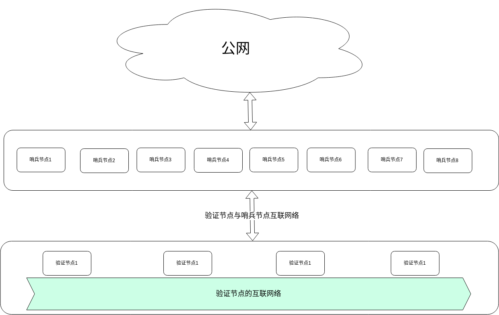
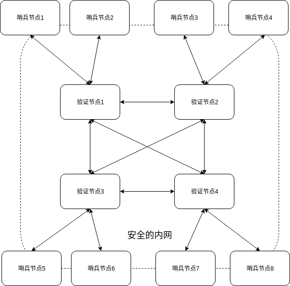

# 从零开始组网部署

## 术语

术语      | 说明  
---------|:-------------------
 全节点   | 区块链的链节点，包含了节点钱包、全量的区块链数据、P2P网络功能等；
 发行工具 |  用来离线生成发行账户、验证节点账户、最初始创世区块配置文件(genesis.json)等
 验证节点 |  做共识出区块的全节点
 哨兵节点 |  特殊的观察节点，不出区块；  为使验证节点隐藏在安全的网络与之内，作为验证节点的代理，暴露在公网；
 观察节点 |  普通全节点，不出区块
   
  

## 网络拓扑

分层的网络结构


节点间的互联 



## 使用发行工具生成核心账户

### 发行工具列表
hsd、hscli

### 初始化
MyMoniker （网络的绰号）；如 Apple、Banana等

MyChainName（链的名称） ; 如 mainnet、testnet、testnet1、testnet2

  
``` 
    hsd init $(MyMoniker) --chain-id $(MyChainName)
```

### 新生成五个账户  
其中 HTDF_ISSUE_ACCT 是 是央行账户（发行账户）

**注意**
 - 以下 12345678 是相关账户的密码，是极度重要关乎整个区块链生死的密码，请自行调整并妥善保管
 - 以下 1000000000000000satoshi、 10000000000000000stake 根据需要自行调整


```
    HTDF_ISSUE_ACCT=`hscli accounts new  12345678`
    ACCT1=`hscli accounts new  12345678`
    ACCT2=`hscli accounts new  12345678`    
    ACCT3=`hscli accounts new  12345678`
    ACCT4=`hscli accounts new  12345678`    
    
    hsd add-genesis-account $HTDF_ISSUE_ACCT 1000000000000000satoshi
    hsd add-genesis-account $ACCT1           10000000000000000stake
    hsd add-genesis-account $ACCT2           10000000000000000stake
    hsd add-genesis-account $ACCT3           10000000000000000stake
    hsd add-genesis-account $ACCT4           10000000000000000stake    
    
    hscli accounts list
    
```


## 8个哨兵节点初始化

```
    #哨兵节点1
    hsd init $(MyMoniker) --chain-id $(MyChainName)
    #哨兵节点2
    hsd init $(MyMoniker) --chain-id $(MyChainName)
    #哨兵节点3
    hsd init $(MyMoniker) --chain-id $(MyChainName)
    #哨兵节点4
    hsd init $(MyMoniker) --chain-id $(MyChainName)
    #哨兵节点5
    hsd init $(MyMoniker) --chain-id $(MyChainName)
    #哨兵节点6
    hsd init $(MyMoniker) --chain-id $(MyChainName)
    #哨兵节点7
    hsd init $(MyMoniker) --chain-id $(MyChainName)
    #哨兵节点8
    hsd init $(MyMoniker) --chain-id $(MyChainName)        
```


## 配置4个验证节点
### 验证节点初始化
```
    #验证节点1
    hsd init $(MyMoniker) --chain-id $(MyChainName)
    
    #验证节点2
    hsd init $(MyMoniker) --chain-id $(MyChainName)
    
    #验证节点3
    hsd init $(MyMoniker) --chain-id $(MyChainName)
    
    #验证节点4
    hsd init $(MyMoniker) --chain-id $(MyChainName)
```
 
### 拷贝配置文件
将发行工具生成的创世区块配置文件(genesis.json)和keyfile，拷贝到验证节点

genesis.json 目录在 ~/.hsd/config/
keyfile 目录在      ~/.hscli/keystores


```    
    #验证节点1： 拷贝创世区块配置文件(genesis.json) 和 $ACCT1 keyFile
    #验证节点2： 拷贝创世区块配置文件(genesis.json) 和 $ACCT2 keyFile
    #验证节点3： 拷贝创世区块配置文件(genesis.json) 和 $ACCT3 keyFile
    #验证节点4： 拷贝创世区块配置文件(genesis.json) 和 $ACCT4 keyFile
```    
    	
### 生成gentx并签名
```    
    #验证节点1    
    hsd gentx $ACCT1
    hsd collect-gentxs
      
    #验证节点2
    hsd gentx $ACCT2
    hsd collect-gentxs
      
    #验证节点3
    hsd gentx $ACCT3
    hsd collect-gentxs
    
    #验证节点4
    hsd gentx $ACCT4
    hsd collect-gentxs
```

### 编辑创世区块配置文件(genesis.json)     
- 先备份验证节点1 的创世区块配置（genesis.json）

- 编辑验证节点1的创世区块配置（genesis.json）
 >  把其他三个节点创世区块配置（genesis.json）中的 gentx 拷贝过来;
 >  并追加到验证节点1的创世区块配置（genesis.json）的gentx中
 >  这个就是最终的创世区块配置文件(genesis.json)

- 把验证节点1 的最新 genesis.json，拷贝到 验证节点2、验证节点3、验证节点4

- 做完以上步骤后， 4个验证节点的创世区块配置（genesis.json） 是一致的(比对各文件的md5sum)


## 配置网络发现的参数

### 查询所有节点的NodeID

8个哨兵节点的NodeID

```
    #哨兵节点1
    SentinelNodeID1=`hsd tendermint show-node-id`
    #哨兵节点2
    SentinelNodeID2=`hsd tendermint show-node-id`
    #哨兵节点3
    SentinelNodeID3=`hsd tendermint show-node-id`
    #哨兵节点4
    SentinelNodeID4=`hsd tendermint show-node-id`
    #哨兵节点5
    SentinelNodeID5=`hsd tendermint show-node-id`
    #哨兵节点6
    SentinelNodeID6=`hsd tendermint show-node-id`
    #哨兵节点7
    SentinelNodeID7=`hsd tendermint show-node-id`
    #哨兵节点8
    SentinelNodeID8=`hsd tendermint show-node-id`
```

4个验证节点的NodeID

```
    #验证节点1
    ValidatorNodeID1=`hsd tendermint show-node-id`
    #验证节点2
    ValidatorNodeID2=`hsd tendermint show-node-id`
    #验证节点3
    ValidatorNodeID3=`hsd tendermint show-node-id`
    #验证节点4
    ValidatorNodeID4=`hsd tendermint show-node-id`    
```


### 4个验证节点，连接其他三个验证节点，以及对应的两个哨兵节点
4个验证节点  ~/.hsd/config/config.toml  的 private_peer_ids ，填上其他三个验证节点、对应的两个哨兵节点的特征值 "NodeID@IP"（多个特征值用逗号"," 分隔）

注意节点IP填写的是内网IP

```
    #验证节点1
    private_peer_ids="ValidatorNodeID2@Validator_2_PRIVATEIPPORT,ValidatorNodeID3@Validator_3_PRIVATEIPPORT,ValidatorNodeID4@Validator_4_PRIVATEIPPORT,SentinelNodeID1@Sentinel_1_PRIVATEIPPORT,SentinelNodeID2@Sentinel_2_PRIVATEIPPORT"
    
    #验证节点2
    private_peer_ids="ValidatorNodeID1@Validator_1_PRIVATEIPPORT,ValidatorNodeID3@Validator_3_PRIVATEIPPORT,ValidatorNodeID4@Validator_4_PRIVATEIPPORT,SentinelNodeID3@Sentinel_3_PRIVATEIPPORT,SentinelNodeID4@Sentinel_4_PRIVATEIPPORT"
    
    #验证节点3
    private_peer_ids="ValidatorNodeID1@Validator_1_PRIVATEIPPORT,ValidatorNodeID2@Validator_2_PRIVATEIPPORT,ValidatorNodeID4@Validator_4_PRIVATEIPPORT,SentinelNodeID5@Sentinel_5_PRIVATEIPPORT,SentinelNodeID6@Sentinel_6_PRIVATEIPPORT"
    
    #验证节点4
    private_peer_ids="ValidatorNodeID1@Validator_1_PRIVATEIPPORT,ValidatorNodeID2@Validator_2_PRIVATEIPPORT,ValidatorNodeID3@Validator_3_PRIVATEIPPORT,SentinelNodeID7@Sentinel_7_PRIVATEIPPORT,SentinelNodeID8@Sentinel_8_PRIVATEIPPORT"

```


### 验证节点不对外暴露节点信息
4个验证节点  ~/.hsd/config/config.toml  的 pex 参数，设置为 false（不对外暴露 验证节点的节点信息）

```
    #验证节点1
    pex=false
    
    #验证节点2
    pex=false
    
    #验证节点3
    pex=false
    
    #验证节点4
    pex=false
```

## 配置8个哨兵节点

### 哨兵节点初始化
请确认，以上第一个步骤已经进行过哨兵节点的初始化    

### 拷贝、修改配置文件

将验证节点的创世区块配置文件(genesis.json)，拷贝到8个哨兵节点(记得比对两边的 md5sum)

genesis.json 目录在 ~/.hsd/config/


### 8个哨兵节点，组网配置

8个哨兵节点~/.hsd/config/config.toml
private_peer_ids ，填上对应验证节点的特征值 "NodeID@IP"（多个特征值用逗号"," 分隔）
persistent_peers ，填写所有哨兵节点的特征值 "NodeID@IP"（多个特征值用逗号"," 分隔）

注意 private_peer_ids 内IP填写的是内网IP
注意 persistent_peers 内IP填写的是公网IP

```
    #哨兵节点1
    private_peer_ids="ValidatorNodeID1@Validator_1_PRIVATEIPPORT"
    persistent_peers="SentinelNodeID1@Sentinel_1_PUBLICIPPORT,SentinelNodeID2@Sentinel_2_PUBLICIPPORT,SentinelNodeID3@Sentinel_3_PUBLICIPPORT,SentinelNodeID4@Sentinel_4_PUBLICIPPORT,SentinelNodeID5@Sentinel_5_PUBLICIPPORT,SentinelNodeID6@Sentinel_6_PUBLICIPPORT,SentinelNodeID7@Sentinel_7_PUBLICIPPORT,SentinelNodeID8@Sentinel_8_PUBLICIPPORT"    

    #哨兵节点2
    private_peer_ids="ValidatorNodeID1@Validator_1_PRIVATEIPPORT"
    persistent_peers="SentinelNodeID1@Sentinel_1_PUBLICIPPORT,SentinelNodeID2@Sentinel_2_PUBLICIPPORT,SentinelNodeID3@Sentinel_3_PUBLICIPPORT,SentinelNodeID4@Sentinel_4_PUBLICIPPORT,SentinelNodeID5@Sentinel_5_PUBLICIPPORT,SentinelNodeID6@Sentinel_6_PUBLICIPPORT,SentinelNodeID7@Sentinel_7_PUBLICIPPORT,SentinelNodeID8@Sentinel_8_PUBLICIPPORT"
    
    #哨兵节点3
    private_peer_ids="ValidatorNodeID1@Validator_2_PRIVATEIPPORT"
    persistent_peers="SentinelNodeID1@Sentinel_1_PUBLICIPPORT,SentinelNodeID2@Sentinel_2_PUBLICIPPORT,SentinelNodeID3@Sentinel_3_PUBLICIPPORT,SentinelNodeID4@Sentinel_4_PUBLICIPPORT,SentinelNodeID5@Sentinel_5_PUBLICIPPORT,SentinelNodeID6@Sentinel_6_PUBLICIPPORT,SentinelNodeID7@Sentinel_7_PUBLICIPPORT,SentinelNodeID8@Sentinel_8_PUBLICIPPORT"
    
    #哨兵节点4
    private_peer_ids="ValidatorNodeID1@Validator_2_PRIVATEIPPORT"
    persistent_peers="SentinelNodeID1@Sentinel_1_PUBLICIPPORT,SentinelNodeID2@Sentinel_2_PUBLICIPPORT,SentinelNodeID3@Sentinel_3_PUBLICIPPORT,SentinelNodeID4@Sentinel_4_PUBLICIPPORT,SentinelNodeID5@Sentinel_5_PUBLICIPPORT,SentinelNodeID6@Sentinel_6_PUBLICIPPORT,SentinelNodeID7@Sentinel_7_PUBLICIPPORT,SentinelNodeID8@Sentinel_8_PUBLICIPPORT"
    
    #哨兵节点5
    private_peer_ids="ValidatorNodeID1@Validator_3_PRIVATEIPPORT"
    persistent_peers="SentinelNodeID1@Sentinel_1_PUBLICIPPORT,SentinelNodeID2@Sentinel_2_PUBLICIPPORT,SentinelNodeID3@Sentinel_3_PUBLICIPPORT,SentinelNodeID4@Sentinel_4_PUBLICIPPORT,SentinelNodeID5@Sentinel_5_PUBLICIPPORT,SentinelNodeID6@Sentinel_6_PUBLICIPPORT,SentinelNodeID7@Sentinel_7_PUBLICIPPORT,SentinelNodeID8@Sentinel_8_PUBLICIPPORT"
    
    #哨兵节点6
    private_peer_ids="ValidatorNodeID1@Validator_3_PRIVATEIPPORT"
    persistent_peers="SentinelNodeID1@Sentinel_1_PUBLICIPPORT,SentinelNodeID2@Sentinel_2_PUBLICIPPORT,SentinelNodeID3@Sentinel_3_PUBLICIPPORT,SentinelNodeID4@Sentinel_4_PUBLICIPPORT,SentinelNodeID5@Sentinel_5_PUBLICIPPORT,SentinelNodeID6@Sentinel_6_PUBLICIPPORT,SentinelNodeID7@Sentinel_7_PUBLICIPPORT,SentinelNodeID8@Sentinel_8_PUBLICIPPORT"
    
    #哨兵节点7
    private_peer_ids="ValidatorNodeID1@Validator_4_PRIVATEIPPORT"
    persistent_peers="SentinelNodeID1@Sentinel_1_PUBLICIPPORT,SentinelNodeID2@Sentinel_2_PUBLICIPPORT,SentinelNodeID3@Sentinel_3_PUBLICIPPORT,SentinelNodeID4@Sentinel_4_PUBLICIPPORT,SentinelNodeID5@Sentinel_5_PUBLICIPPORT,SentinelNodeID6@Sentinel_6_PUBLICIPPORT,SentinelNodeID7@Sentinel_7_PUBLICIPPORT,SentinelNodeID8@Sentinel_8_PUBLICIPPORT"
    
    #哨兵节点8
    private_peer_ids="ValidatorNodeID1@Validator_4_PRIVATEIPPORT"
    persistent_peers="SentinelNodeID1@Sentinel_1_PUBLICIPPORT,SentinelNodeID2@Sentinel_2_PUBLICIPPORT,SentinelNodeID3@Sentinel_3_PUBLICIPPORT,SentinelNodeID4@Sentinel_4_PUBLICIPPORT,SentinelNodeID5@Sentinel_5_PUBLICIPPORT,SentinelNodeID6@Sentinel_6_PUBLICIPPORT,SentinelNodeID7@Sentinel_7_PUBLICIPPORT,SentinelNodeID8@Sentinel_8_PUBLICIPPORT"
```


## 启动节点

### 启动8个哨兵节点
启动8个哨兵节点

日志文件名及目录，请根据需要调整
```
    #启动app进程    
    nohup hsd start >> $(HOME)/.hsd/app.log  2>&1  &
    
    #启动restServer
    nohup hscli rest-server --chain-id=$(MyChainName) --trust-node=true  --laddr=tcp://0.0.0.0:1317  >> $(HOME)/.hsd/restServer.log  2>&1  &

```

观察日志，查看各哨兵节点间的连接是否正常；
由于目前只有哨兵节点，暂时看不到出块的日志
```
    #当前节点
    tail -f $(HOME)/.hsd/app.log        
```


### 启动4个验证节点
启动4个验证节点

日志文件名及目录，请根据需要调整
```
    #启动app进程    
    nohup hsd start >> $(HOME)/.hsd/app.log  2>&1  &
    
    #启动restServer
    nohup hscli rest-server --chain-id=$(MyChainName) --trust-node=true  --laddr=tcp://0.0.0.0:1317  >> $(HOME)/.hsd/restServer.log  2>&1  &
    
```

观察日志，查看4个验证节点和8个哨兵节点连接是否正常，是否有出块日志
```
    #当前节点
    tail -f $(HOME)/.hsd/app.log    
```


     


